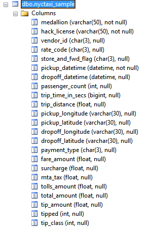

# Dicionários de Dados
_Local para colocar documentos que descrevam os dados, geralmente recebidos do cliente._
Normalmente é uma descrição a nível de campo dos arquivos de dados recebidos.

Esse documento fornece descrições do dado que foi fornecido pelo cliente. Se o cliente providenciou os dicionários em formato de texto (por email ou arquivo), copie tudo diretamente para cá, ou tenha um print do texto e adicione-o como imagem aqui. Se foi fornecido em formatos do Excel, coloque os arquivos nesse diretório e adicione um link para esse arquivo.

Se o cliente forneceu o dado no formato de um sistema de gerenciamento de banco de dados, você também pode copiar e colar o schema (em print) aqui. Se necessário informe também uma descrição de cada coluna da imagem (caso a imagem não contenha essa informação).

## <Nome do Conjunto de Dados 1 (de um banco de dados)\>

_Exemplo de schema de um banco de dados sql_

## <Nome do Conjunto de Dados 2 (de um arquivo de planilha)\>

[dataset 2 with dictionary in Excel](./Raw-Data-Dictionary.csv)
